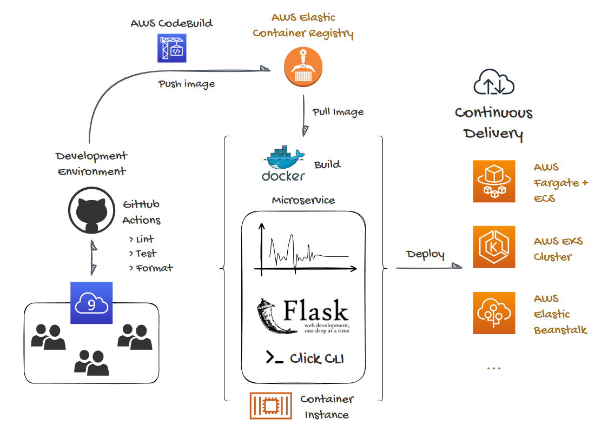

[](https://github.com/erich-hs/ts-stationarity-micro/actions/workflows/main.yml)  

# Time Series Stationarity Check Microservice
Containerized microservice for Time Series stationarity testing with Augmented Dickey-Fuller (ADF) and Kwiatkowski-Phillips-Schmidt-Shin (KPSS) tests.



## About this Repository
This is a template repository of a containerized Python Flask Microservice with best CI/CD practices for local deployment or in the cloud.

An AWS CodeBuild workflow is configured to push the latest Docker image to an AWS ECR (Elastic Container Registry). You can refer to the deploy task in this sample [Makefile](Makefile). The build is set to trigger on every push to the GitHub repository via buildspec.yml (AWS CodeBuild) and main.yml (GitHub Actions).


This microservice template can be deployed in most AWS Elastic IaaS solutions such as Elastic Beanstalk, AWS EKS, and AWS Fargate + AWS ECS. The build is fully integrated within the AWS environment, from the base [Python 3.9 Docker image](https://gallery.ecr.aws/lambda/python) that is pulled from AWS public ECR, to the final development image that is pushed and pulled to the project AWS ECR repository.

The IAM role permissions to push to an ECR repository can be found in this [link](https://docs.aws.amazon.com/AmazonECR/latest/userguide/image-push.html).

For a sample deployment with AWS Elastic Beanstalk you can follow the procedures in this [template repository](https://github.com/erich-hs/aws-eb-flask). Make sure you create an AWS ECR repository and update the Makefile with your repository URI that can be found under 'View push commands'.

## Local Deployment - Docker
Fore the following steps you need a version of [Docker Desktop](https://www.docker.com/products/docker-desktop/) suitable to your working environment.

### Clone the Repository:
Clone and cd to the repository folder
```
$ git clone git@github.com:erich-hs/ts-stationarity-micro.git
$ cd ts-stationarity-micro
```

### Docker Image:
Build image locally
```bash
$ docker build --tag ts-micro .
```
Check built image
```
$ docker image ls
```
Run a -d dettached local container based on built image, and map localhost:8080 to container port 8080
```
$ docker run -p 127.0.0.1:8080:8080 --name ts-micro-local -d ts-micro
```
Docker should return the container ID. You can see it running with
```
$ docker ps
```
You can now curl from the local machine to send data with a POST method
```bash
$ curl -d '{"timeseries":[1, 2, 3, 4]}' \
-H "Content-Type: application/json" \
-X POST http://localhost:8080/test_stationarity
```

### Shutting down:
Shut down the container
```
$ docker stop ts-micro-local
```
Remove the container
```
$ docker rm ts-micro-local
```

## Local Deployment - Native Environment
### To post a sample stationarity test:
Add permissions to sample_post.sh:
```bash
$ chmod +x ./sample_post.sh
```
Execute sample_post.sh
```bash
$ ./sample_post.sh
```

### To directly access the Python function:
Call the python interpeter -c code:
```
$ python -c 'import stationarity; print(stationarity.stationarity_test([1, 2, 3, 4]))'
```

### To host the application in the local machine:
Run the Flask app locally:
```bash
$ python app.py
```
POST method
```bash
$ curl -d '{"timeseries":[1, 2, 3, 4]}' \
-H "Content-Type: application/json" \
-X POST http://localhost:8080/test_stationarity
```

### To run from your CLI:
Call the custom CLI function
```bash
$ python cli.py
```
It should prompt you for the time series input:

```
List-like, comma separated time series: 1, 2, 3, 4
```
After inserting a comma separated example the result should be similar to the output below:


